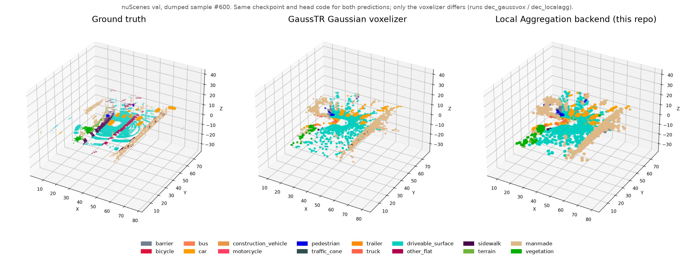

# LocalAggTR — a Local Aggregation voxelizer backend for GaussTR, ~7× faster inference



*Figure 1. Only the voxelizer is swapped: the same GaussTR checkpoint and head run with GaussTR's heuristic voxelizer (baseline, dashed) or GaussianFormer's Local Aggregation op (ours, solid; third-party, see [`third_party/README.md`](third_party/README.md)). Local Aggregation makes voxelization differentiable, opening a gradient path from a 3D occupancy loss back to the Gaussians (not trained here). Panels show the final head prediction for nuScenes val sample 600; time is end-to-end per sample (conditions under Key result). Camera images: [nuScenes](https://www.nuscenes.org/), CC BY-NC-SA 4.0; this figure is licensed likewise.*

## Key result

| nuScenes val (6019 samples) | GaussTR voxelizer, head as received | GaussTR voxelizer, same head as ours | **Local Aggregation (ours)** |
|---|---|---|---|
| Test time per sample, median (s) | 3.4687 | 4.0872 | **0.5680** (6.11× / 7.20× faster) |
| mIoU | 0.1352 | 0.1107 | **0.1142** (−15.5% / +3.2%) |
| IoU (binary occupancy) | 0.4563 | 0.2521 | **0.3164** (−30.7% / +25.5%) |

*Relative changes in brackets are vs. column 1 / column 2.*
*Conditions: 1 run per setting; nuScenes val with camera-visibility mask; 1× RTX 2080 Ti, batch 1. The time is for the whole test loop (all components), not the voxelizer alone.*
*All runs are test-time only. They use the same weakly supervised checkpoint and swap only the voxelizer / head code; nothing was retrained with Local Aggregation.*
*Every number is traced to a log line in [`results/NUMBERS.md`](results/NUMBERS.md).*

**Reading the table.**
- Against the original GaussTR voxelizer (column 1), Local Aggregation is about 6× faster but loses accuracy.
- With the same head preprocessing (column 2), it is 7.2× faster at similar mIoU.
- Most of the IoU difference between columns 1 and 2 comes from my head changes (scale cap / sanitization), not from the voxelizer; see [Results](#results).

## Motivation

GaussTR predicts a set of 3D Gaussians and turns them into a semantic occupancy grid at test time. Its voxelizer
(`GaussianVoxelizer`) loops over Gaussians in Python and writes each one into its bounding-box voxels. With it, one test
step on nuScenes takes 3.5–4.1 s per sample, versus 0.57 s when only the voxelizer is replaced (table above). The lab project this work belongs to needed a Gaussian-to-voxel step that is fast and has a CUDA
backward pass, so that a 3D occupancy loss could later be applied to the Gaussians. GaussianFormer's Local
Aggregation op meets both needs. It was written for GaussianFormer's own Gaussians, so using it in GaussTR needed an adapter,
input sanitization and a free-space rule. That adapter and those rules are this repo.

## Method

See Figure 1 (top of this page) for where the swapped voxelizer sits in the pipeline.

Key design choices:
1. **One head, two backends, switched by config.** `voxelizer=dict(type='LocalAggWrapper' | 'GaussianVoxelizerCompat')`. Both backends receive the same sanitized Gaussians, so a comparison changes only the voxelizer. (`src/localagg_tr/dual_backend_head.py`, `configs/voxelizer_*.py`)
2. **Sanitize Gaussians before voxelization.** The head drops non-finite and out-of-range Gaussians (sets their opacity to 0) using a right-open `pc_range` bound shared with the voxelizer. It applies `softplus` with a per-axis cap to scales (`s_max_xyz = 0.26 m`) and a floor of 5e-4 to opacities. The wrapper adds a hard gate (NaN / out of range) and a soft gate that attenuates very weak Gaussians. Without these, a few huge or invalid Gaussians flood the CUDA kernel. (`sanitize_gaussians`, `src/localagg_tr/localagg_wrapper.py`)
3. **Density-normalised logits + quantile free space.** Local Aggregation returns opacity-weighted class logits. A second pass with all-ones semantics gives a density proxy. Logits are divided by it, and voxels at or below the per-sample 90th density percentile (`tau_quantile=0.9`) are labelled free. (`_forward_predict_localagg`)

## Results

All runs: same checkpoint, nuScenes val, 1 run each. Full tables, including per-class IoU and source line numbers, are in [`results/NUMBERS.md`](results/NUMBERS.md).

| Run | Voxelizer | Head code | IoU | mIoU | Median s / sample |
|---|---|---|---|---|---|
| Aug 2025 | GaussTR `GaussianVoxelizer` | as received from the lab | 0.4563 | 0.1352 | 3.4687 |
| Oct 2025 (v1) | Local Aggregation | early version | 0.2261 | 0.0652 | 0.5583 |
| Oct 2025 (v2) | Local Aggregation | early version, `tau_quantile=0.2` | 0.2255 | 0.0659 | 0.6116 |
| Dec 2025 | Local Aggregation | final (this repo) | 0.3164 | 0.1142 | 0.5680 |
| Dec 2025 | GaussTR voxelizer (`GaussianVoxelizerCompat`) | final (this repo) | 0.2521 | 0.1107 | 4.0872 |

**Failure case: the head changes hurt the original voxelizer.**
- With the final head, the GaussTR voxelizer drops from 0.4563 to 0.2521 IoU (−44.8%).
- The checkpoint was trained before the scale cap / softplus existed (the log reports `missing keys ... s_max_xyz`). Applying them only at test time changes the Gaussian sizes the model was trained with. This is the likely cause; I have not verified it.
- A fair accuracy comparison would retrain with the final head, and I have not done that.

**No controlled ablation.** The October → December change mixes config (`tau_quantile`, `s_max_xyz`) and code changes. The table above is a development history, not an ablation.

## Reproduce

The numbers above **cannot be reproduced from this repo alone**. They need two things that are not released:
- the lab's weakly supervised GaussTR model and its checkpoint (`iter_56272.pth`), which produce the Gaussians;
- the nuScenes / Occ3D data prepared following GaussTR.

Results were produced with GaussTR commit [`f29cb2a`](https://github.com/hustvl/GaussTR/tree/f29cb2a) plus the code in `src/`.

What you can run:

```bash
# environment (versions of the original experiments)
conda env create -f environment.yml && conda activate localaggtr
git clone https://github.com/hustvl/GaussTR.git && git -C GaussTR checkout f29cb2a
# third-party op: see third_party/README.md (GaussianFormer local_aggregate, CUDA)

# head module on synthetic Gaussians: both backends, shape / class / gating checks (CUDA GPU)
PYTHONPATH=GaussTR:src python scripts/smoke_test.py
```

> Status: `scripts/smoke_test.py` has not been executed. The released code was checked against the original only as text (identical code blocks), not by running it.

To plug the head into your own GaussTR-style model, follow the usage docstring at the top of
`src/localagg_tr/dual_backend_head.py`. Then add `custom_imports=dict(imports=['gausstr', 'localagg_tr'])` and one
voxelizer fragment from `configs/`. For test-time dumps and plots, see `configs/dump_hooks.py` and `scripts/visualize_*_voxels.py`.

## Context

- **Type:** MSc capstone project, AIR5050, CUHK-Shenzhen
- **Period:** Sep 2025 – Dec 2025
- **Supervisor:** Prof. Huang Rui
- **Collaborators:** part of a lab project on weakly supervised 3D occupancy led by Zhang Chi (PhD). The 3D Gaussian weak-supervision pipeline, the training code and the checkpoint used above are the lab's work and are not included here.
- **My contribution:** the occupancy head module in this repo: `src/localagg_tr/` (Local Aggregation adapter, dual-backend head with Gaussian sanitization and free-space rule, GaussTR voxelizer interface subclass, dump hooks), `configs/`, and `scripts/`. I did not write the Local Aggregation CUDA op (GaussianFormer / Inria, see below) or GaussTR.
- **Status:** completed (course project); released with permission of the project lead.

## Citation / Acknowledgements

- **GaussTR** (MIT License). This repo builds on its model code and its `GaussianVoxelizer`. https://github.com/hustvl/GaussTR
  ```bibtex
  @inproceedings{GaussTR,
      title     = {GaussTR: Foundation Model-Aligned Gaussian Transformer for Self-Supervised 3D Spatial Understanding},
      author    = {Haoyi Jiang and Liu Liu and Tianheng Cheng and Xinjie Wang and Tianwei Lin and Zhizhong Su and Wenyu Liu and Xinggang Wang},
      year      = 2025,
      booktitle = {CVPR}
  }
  ```
- **GaussianFormer.** The Local Aggregation CUDA op is **not included and not my work**. It is installed from https://github.com/huang-yh/GaussianFormer; see [`third_party/README.md`](third_party/README.md).
  ```bibtex
  @article{huang2024gaussian,
      title={GaussianFormer: Scene as Gaussians for Vision-Based 3D Semantic Occupancy Prediction},
      author={Huang, Yuanhui and Zheng, Wenzhao and Zhang, Yunpeng and Zhou, Jie and Lu, Jiwen},
      journal={arXiv preprint arXiv:2405.17429},
      year={2024}
  }
  ```
- **Inria 3D Gaussian Splatting.** The op's source files carry Inria copyright headers, and its license allows non-commercial research and evaluation use only. https://github.com/graphdeco-inria/gaussian-splatting
- License of this repo: see `LICENSE`. It covers `src/`, `configs/` and `scripts/` only.
